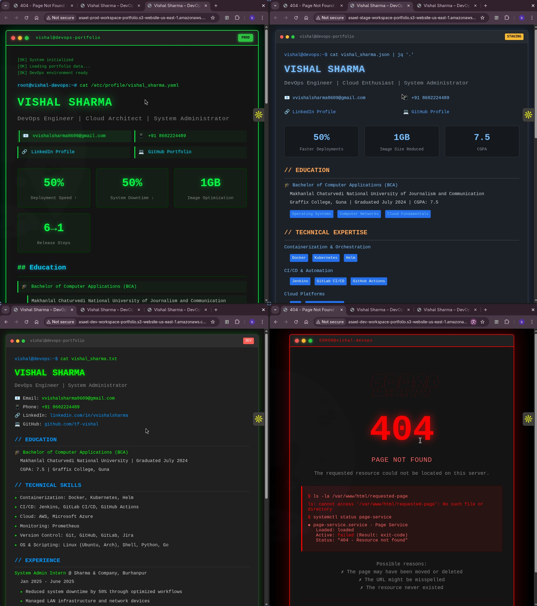

# Terraform Workspace Portfolio Project

A demonstration project showcasing Terraform workspaces to manage multiple environment deployments (dev, staging, production) for a static portfolio website hosted on AWS S3.

## 📋 Project Overview

This project demonstrates the use of **Terraform Workspaces** to manage infrastructure across different environments using a single codebase. Each workspace deploys an isolated S3 bucket configured as a static website, complete with environment-specific content.

### 🎯 One-Command Deployment

This project includes automation scripts for hassle-free deployment:

- **`create_WS.sh`** - Creates all workspaces and deploys infrastructure to dev, stage, and prod
- **`delete_WS.sh`** - Destroys all infrastructure and deletes all workspaces

No need to manually manage workspaces or run multiple terraform commands!

### Key Features

- 🔄 Multi-environment management using Terraform workspaces
- 🪣 AWS S3 bucket configuration for static website hosting
- 🌐 Environment-specific HTML content (dev, staging, prod)
- 🔐 Public access configuration with bucket policies
- 📝 Custom error page handling
- 🚀 Automated workspace creation and deletion scripts

## 🏗️ Architecture

The project creates isolated S3 buckets for each environment:

- **Dev Environment**: `asael-dev-workspace-portfolio`
- **Staging Environment**: `asael-stage-workspace-portfolio`
- **Production Environment**: `asael-prod-workspace-portfolio`

Each bucket is configured with:
- Static website hosting enabled
- Public read access for web content
- Environment-specific index.html
- Shared error.html page

## 📁 Project Structure

```
.
├── create_WS.sh          # Script to create workspaces
├── delete_WS.sh          # Script to delete workspaces
├── index/                # HTML content directory
│   ├── dev/
│   │   └── index.html   # Development environment page
│   ├── error.html       # Shared error page
│   ├── prod/
│   │   └── index.html   # Production environment page
│   └── stage/
│       └── index.html   # Staging environment page
├── main.tf              # Main infrastructure configuration
├── output.tf            # Output definitions
├── provider.tf          # AWS provider configuration
└── terraform.tfstate.d/ # Workspace state files directory
```

## 🚀 Getting Started

### Prerequisites

- [Terraform](https://www.terraform.io/downloads) (v1.0 or later)
- AWS CLI configured with appropriate credentials
- An AWS account with S3 permissions

### Quick Start

1. **Clone the repository**
   ```bash
   git clone <your-repo-url>
   cd terraform-workspace-portfolio
   ```

2. **Deploy everything** (creates workspaces and infrastructure)
   ```bash
   chmod +x create_WS.sh
   ./create_WS.sh
   ```

   That's it! The script will:
   - Initialize Terraform
   - Create all workspaces (dev, stage, prod)
   - Deploy infrastructure to each environment
   - Output the website URLs for each environment

3. **Clean up everything** (when you're done)
   ```bash
   chmod +x delete_WS.sh
   ./delete_WS.sh
   ```

   This will:
   - Destroy all infrastructure across all workspaces
   - Delete all workspaces
   - Clean up state files

## 💻 Usage

### Automated Deployment (Recommended)

**Deploy all environments:**
```bash
./create_WS.sh
```

**Destroy all environments:**
```bash
./delete_WS.sh
```

### Manual Operations (Optional)

If you need to work with individual environments:

1. **Select a workspace**
   ```bash
   terraform workspace select dev
   ```

2. **Review the plan**
   ```bash
   terraform plan
   ```

3. **Apply the configuration**
   ```bash
   terraform apply
   ```

4. **View the website URL**
   ```bash
   terraform output website_endpoint
   ```

### Switching Between Environments

```bash
# List all workspaces
terraform workspace list

# Switch to staging
terraform workspace select stage

# Check current workspace
terraform workspace show
```

### Destroying Individual Environments

To destroy resources in a specific environment:

```bash
terraform workspace select dev
terraform destroy
```

## 🔧 Configuration Details

### Main Resources

- **aws_s3_bucket**: Creates the S3 bucket with environment-specific naming
- **aws_s3_bucket_ownership_controls**: Configures bucket ownership settings
- **aws_s3_bucket_public_access_block**: Manages public access settings
- **aws_s3_bucket_website_configuration**: Enables static website hosting
- **aws_s3_object**: Uploads HTML files (index.html and error.html)
- **aws_s3_bucket_policy**: Sets up public read access policy

### Dynamic Configuration

The project uses Terraform's workspace feature to dynamically set the environment:

```hcl
locals {
  env = terraform.workspace
}
```

This local variable is used throughout the configuration to:
- Name buckets uniquely per environment
- Tag resources with the environment name
- Select the correct HTML content for each environment

## 📊 Outputs

The configuration outputs the following information (defined in `output.tf`):

- Website endpoint URL
- Bucket ARN
- Environment name

## 🎨 Customization

### Adding a New Environment

1. Create the workspace:
   ```bash
   terraform workspace new <env-name>
   ```

2. Create environment-specific content:
   ```bash
   mkdir -p index/<env-name>
   # Add your index.html file
   ```

3. Deploy:
   ```bash
   terraform workspace select <env-name>
   terraform apply
   ```

### Modifying Bucket Names

Edit the bucket name pattern in `main.tf`:
```hcl
bucket = "your-prefix-${local.env}-suffix"
```

## 🔒 Security Considerations

⚠️ **Important**: This project configures S3 buckets for public web hosting. Consider the following:

- All content in the buckets is publicly accessible
- Ensure no sensitive data is uploaded to these buckets
- Review bucket policies before deploying to production
- Consider adding CloudFront for production workloads
- Implement proper IAM policies for Terraform execution

## 📝 Screenshots

The project includes portfolio screenshots showing:
- **Production Environment**: Green-themed terminal display with performance metrics
- **Staging Environment**: Blue-themed display with optimization stats
- **Development Environment**: Red-themed display
- **Error Page**: Custom 404 error handling



## 🤝 Contributing

This is a learning project demonstrating Terraform workspaces. Feel free to:
- Fork the repository
- Experiment with different configurations
- Share your learnings

## 📚 Learning Resources

- [Terraform Workspaces Documentation](https://www.terraform.io/docs/language/state/workspaces.html)
- [AWS S3 Static Website Hosting](https://docs.aws.amazon.com/AmazonS3/latest/userguide/WebsiteHosting.html)
- [Terraform AWS Provider](https://registry.terraform.io/providers/hashicorp/aws/latest/docs)
- [Pravesh Sudha's Dev Blogs](https://dev.to/aws-builders/how-i-built-my-terraform-portfolio-projects-repos-and-lessons-learned-2pa8)

## 📧 Contact

**Vishal Sharma**  
DevOps Engineer | Cloud Architect | System Administrator

- 📧 Email: vvishalsharma0609@gmail.com
- 🔗 LinkedIn: [linkedin.com/in/vvishalsharma](https://linkedin.com/in/vvishalsharma)
- 💻 GitHub: [github.com/tf-vishal](https://github.com/tf-vishal)

## 📄 License

This project is open and available for educational purposes.

---

**Note**: Remember to clean up your resources when done testing to avoid AWS charges:
```bash
./delete_WS.sh
```